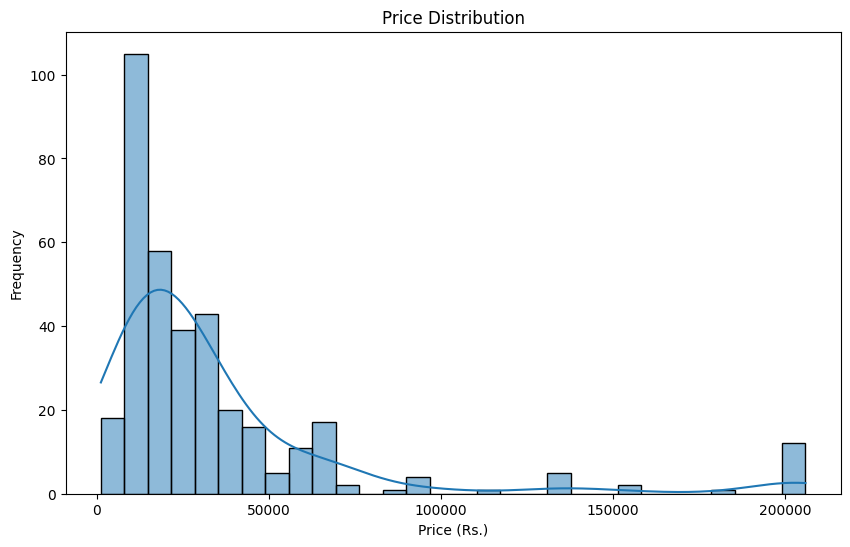
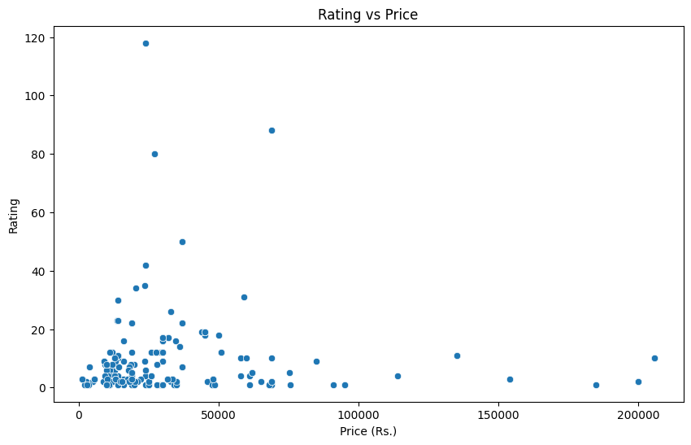
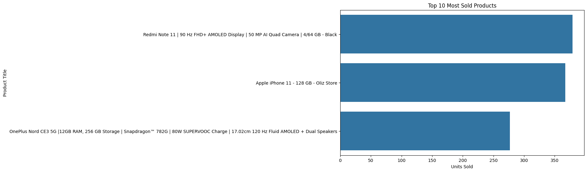
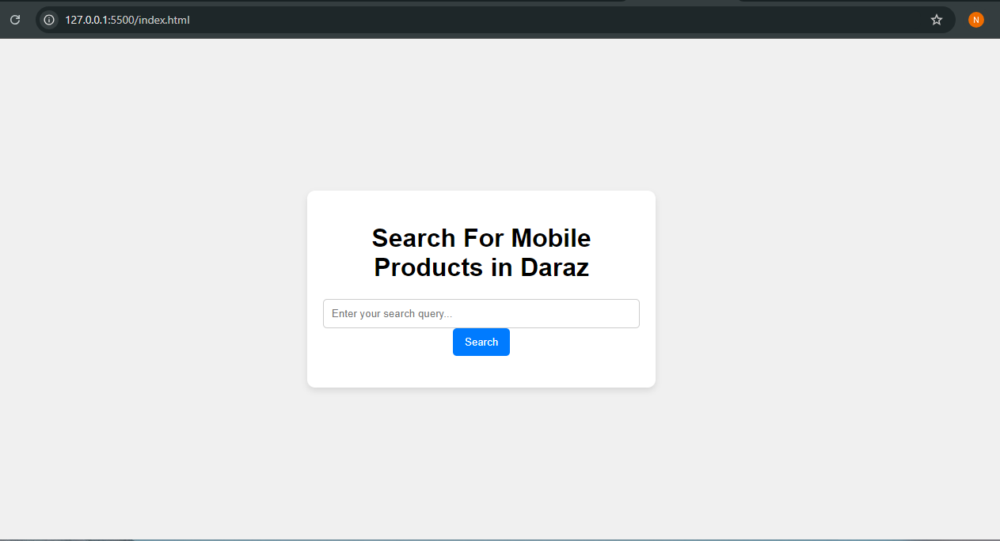
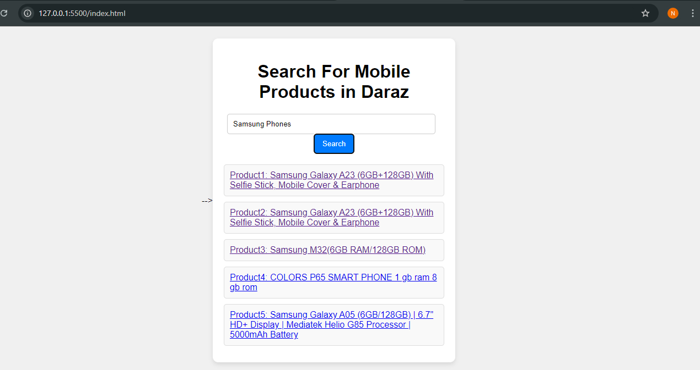

# Semantic-Search-Engine-for-Mobile-Products-from-Daraz
# Project Overview
This project implements a semantic search engine that retrieves similar mobile product titles based on user queries. Using natural language processing (NLP) techniques and pre-trained transformer models, the system provides relevant product information such as price, rating, and availability.

## Workflow

### 1. Data Preprocessing and Embedding Storage
- The dataset (product titles and details) is passed through a **preprocessing pipeline** to clean and standardize the data.
- After preprocessing, the product titles are converted into vector representations (**document embeddings**) using a **SentenceTransformer** model.
- These **document embeddings** are stored for efficient retrieval.

### 2. Query Processing and Embedding Generation
- When a user inputs a search query, it is passed through the **same preprocessing pipeline** to clean and normalize the query text.
- The cleaned query is then converted into vector embeddings (**query embeddings**) using the same **SentenceTransformer** model.

### 3. Similarity Computation
- The **query embeddings** are compared with the stored **document embeddings** using **cosine similarity** to find the closest matches.
- The most similar documents (product titles) are retrieved and ranked based on their similarity scores.

### 4. Results
- The top results, including relevant product details (title, price, rating, etc.), are returned to the user with clickable links to the product pages

## Data Visualization
Here is an example of the data distribution from the dataset:

## Output

## Model Used: SentenceTransformer

This project uses the `SentenceTransformer` model, specifically the `paraphrase-MiniLM-L6-v2` variant, which is a pre-trained transformer model optimized for semantic similarity tasks. It converts text (product titles and search queries) into vector embeddings, allowing for efficient and accurate similarity computation. The model is lightweight and suitable for real-time search applications while maintaining high accuracy in retrieving relevant results.

For more information about SentenceTransformers, you can visit the [official documentation](https://www.sbert.net/).

## Cosine Similarity

To find the most relevant product titles based on user queries, this project uses **cosine similarity** to compare the embeddings of the query and the product titles. Cosine similarity measures the angle between two vectors, providing a value between -1 and 1, where:
- 1 indicates perfect similarity (same direction),
- 0 indicates no similarity (orthogonal vectors),
- -1 indicates perfect dissimilarity (opposite directions).

In this project, cosine similarity is used to rank the products, with the highest similarity score indicating the most relevant results.

